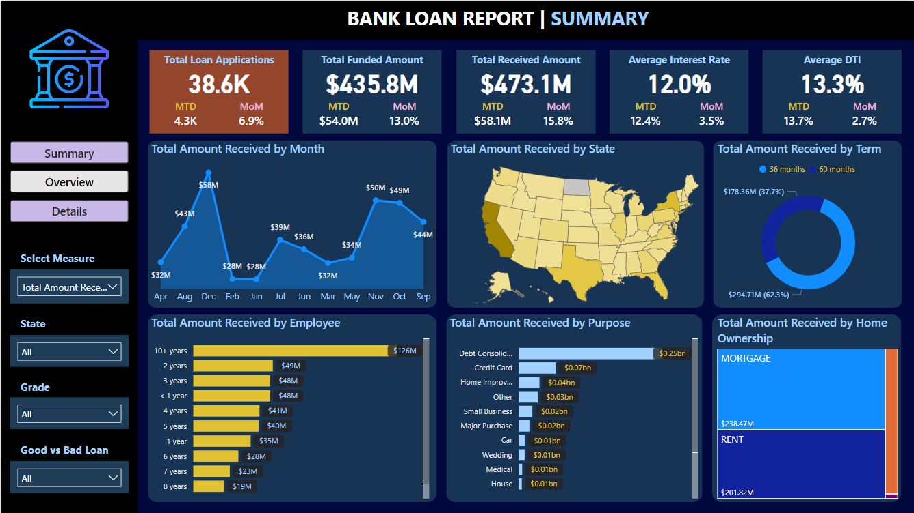

 

  

  <h3 align="center">Bank Loan Report Project</h3>

  

    By leveraging Excel, Power BI, and SQL, this Bank Loan Report project provides a robust foundation for data-driven decision-making, enabling a comprehensive understanding of lending operations, risk management, and customer behavior within the banking sector.
     
     
    <a href="https://github.com/m-aviarchuk/Bank_Loan_Report_Project"><strong>Explore the docs »</strong></a>
     
     
    <a href="https://github.com/m-aviarchuk/Bank_Loan_Report_Project">View Demo</a>
    .
    <a href="https://github.com/m-aviarchuk/Bank_Loan_Report_Project/issues">Report Bug</a>
    .
    <a href="https://github.com/m-aviarchuk/Bank_Loan_Report_Project/issues">Request Feature</a>
  

## Table Of Contents

* [About the Project](#about-the-project)
* [Built With](#built-with)
* [Usage](#usage)
* [License](#license)
* [Authors](#authors)
* [Acknowledgements](#acknowledgements)

## About The Project

**SITUATION**:
Our bank aimed to enhance monitoring and assessment of lending activities, necessitating the creation of a comprehensive Bank Loan Report. The goal was to derive insights into key loan metrics, track changes over time, and enable data-driven decision-making to optimize lending strategies.

**TASK**:
The challenge involved developing a Bank Loan Report with two distinct dashboards. The first dashboard, 'Summary,' required tracking KPIs such as total loan applications, funded amounts, amounts received, average interest rates, and average debt-to-income ratios. Additionally, a 'Good Loan v Bad Loan' report was needed to evaluate lending performance based on loan status criteria.

**ACTION**:
To tackle this, I designed and implemented a robust data pipeline using Excel, Power BI, and SQL. I utilized Excel for initial data cleaning, Power BI for visualization, and SQL for advanced data manipulation. This involved creating calculated columns, aggregating data, and designing a complex data model to facilitate dynamic reporting. The dashboards were then crafted in Power BI, integrating a variety of visualizations to present the KPIs and distinguish between good and bad loans effectively.

**RESULT**:
The Bank Loan Report project yielded a comprehensive set of dashboards that empowered our bank with a holistic view of lending operations. The executive-level 'Summary' dashboard provided quick insights into key metrics, aiding in strategic decision-making. The 'Good Loan v Bad Loan' report offered a nuanced evaluation of lending quality, contributing to improved portfolio management and informed lending strategies. Overall, the project significantly enhanced our ability to assess the health of the loan portfolio and make data-driven decisions.

## Built With

**Excel:**

***Data Cleaning Techniques:***
Advanced Excel functions (e.g., IF, VLOOKUP) for data cleaning, handling missing values, and ensuring data consistency.

***Dynamic Reporting with Pivot Tables:***
Utilized Pivot Tables for dynamic reporting, allowing users to analyze data based on different dimensions (e.g., time periods, loan terms).

***Advanced Formulas for KPIs:***
Implemented complex Excel formulas, including nested functions, to calculate KPIs such as average interest rate and debt-to-income ratio.

***Scenario Analysis with Data Tables:***
Employed Excel's Data Table feature for scenario analysis, assessing the impact of different variables on key metrics.

**Power BI:**

***Data Transformation with Power Query:***
Leveraged Power Query for data transformation, ensuring data from various sources is cleaned, formatted, and loaded seamlessly.

***Advanced Data Modeling:***
Utilized advanced data modeling features in Power BI, including DAX measures and calculated columns, to create intricate relationships and custom metrics.

***Time Intelligence with DAX:***
Implemented DAX (Data Analysis Expressions) for time-related analysis, allowing for dynamic calculations of MTD and MoM changes.

***Hierarchical Data Presentation:***
Employed hierarchies in Power BI for effective drill-downs, providing users with a detailed view of data at different levels.

**SQL**:

***Complex Queries for Classification:***
Utilized advanced SQL queries incorporating CASE statements to classify loans into 'Good' and 'Bad' categories based on specific loan status criteria.

***Window Functions for Trend Analysis:***
Employed SQL window functions, specifically LAG, for trend analysis. Calculated running totals and averages over specified periods to analyze month-over-month changes in loan metrics.

***Data Aggregation with GROUP BY:***
Implemented GROUP BY clauses in SQL queries to perform data aggregation. Calculated total loan applications, funded amounts, and amounts received by grouping data based on month and year.

***Database Optimization:***
Implemented SQL optimization techniques, including indexing and query optimization, to enhance database performance. Ensured efficient data retrieval for reporting and analysis purposes.

## Usage

Use this space to show useful examples of how a project can be used. Additional screenshots, code examples and demos work well in this space. You may also link to more resources.

_For more examples, please refer to the [Documentation](https://example.com)_

### Creating A Pull Request

## License

Distributed under the MIT License. See [LICENSE](https://github.com/m-aviarchuk/Bank_Loan_Report_Project/blob/main/LICENSE.md) for more information.

## Authors

* **** - ** -  - **

## Acknowledgements

* 
* 
* 
